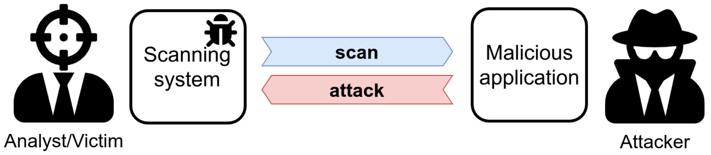

# RevOK

We see the targets of our scan as passive entities, and this leads to underestimating the risk of performing a scan. However, the tools we use to scan are not immune to vulnerabilities.
Testing these bugs is often hard since they require a dedicated testing infrastructure: RevOK supports analysts by simulating a malicious target and by tracking data in the security scanner.



While the focus is on security scanners, RevOK can be used to test any software that takes (attacker-controlled) third-party data and displays it to a user (e.g., server-side REST API calls).

RevOK helped us to find two [XSS to RCE bugs in Metasploit Pro](https://avalz.it/research/metasploit-pro-xss-to-rce/)[2] ([CVE-2020-7354](https://cve.mitre.org/cgi-bin/cvename.cgi?name=2020-7354) and [CVE-2020-7355](https://cve.mitre.org/cgi-bin/cvename.cgi?name=2020-7355)), as well as many other vulnerabilities.
We described this technique in our paper ["Never Trust Your Victim: Weaponizing Vulnerabilities in Security Scanners"](https://www.researchgate.net/publication/344642774_Never_Trust_Your_Victim_Weaponizing_Vulnerabilities_in_Security_Scanners), accepted at [RAID 2020](https://raid2020.org/).

## How to cite us

RevOK implements the automatic testing methodology presented in ["Never Trust Your Victim: Weaponizing Vulnerabilities in Security Scanners"](https://www.researchgate.net/publication/344642774_Never_Trust_Your_Victim_Weaponizing_Vulnerabilities_in_Security_Scanners).

If you want to cite us, please use the following (BibTeX) reference:

```
@inproceedings {valenza20revok,
author = {Andrea Valenza and Gabriele Costa and Alessandro Armando},
title = {Never Trust Your Victim: Weaponizing Vulnerabilities in Security Scanners},
booktitle = {23rd International Symposium on Research in Attacks, Intrusions and Defenses ({RAID} 2020)},
year = {2020},
isbn = {978-1-939133-18-2},
address = {San Sebastian},
pages = {17--29},
url = {https://www.usenix.org/conference/raid2020/presentation/valenza},
publisher = {{USENIX} Association},
month = oct,
}
```


## Getting started

The core of RevOK is the **stub** component.
It listens for incoming requests and sends attack responses.

Responses are crafted from a *template file* and a *substitution list* containing attack payloads.
```
python cli.py stub TEMPLATE_FILE SUBSTITUTION_LIST
```

This is an example of a template file:
```
HTTP/1.1 200 OK
Server: $a

<html>
<head><title>Title</title></head>
<body>
    <h1>My page</h1>
</body>
</html>
```

For each incoming request, the **stub** substitutes the placeholder (`$a` by default) with a new element of the substitution list.
You can also define custom placeholders using the `--placeholder` (`-p`) switch. Example usage:
```
python cli.py stub example.template example.substitutions -p "$a"
```
You can find `example.template` and `example.substitutions` in this repo. WARNING: **stub** will substitute ANY occurrence of the defined placeholder; choose one that does not occur in any other part of the template.

You can also define a specific port using the `--port` switch, for example:

```
python cli.py stub example.template example.substitutions --port 3000
```

Additional options are available from the `--help` switch.

```
:~$ python cli.py stub --help

Usage: cli.py stub [OPTIONS] [TEMPLATE] [SUBSTITUTIONS]

    Run a stub that serves tracking responses.

Options:
    --log-file TEXT
    --port INTEGER
    --help           Show this message and exit.
```

### Automatic token deployment

"All responses are equal, but some responses are more equal than others"

Responses are not all parsed in the same way.
Some parsers accept that the *Status message* is something different from "OK" or "Moved permanently",
others do not and discard the response.

To make testing easier, the stub component has a *tracking mode*, where it generates responses based on
a [*probabilistic context-free grammar*](fuzzer/probabilistichttpfuzzer.py).

You can launch the tracking mode of the stub component without defining the template and substitution list:

```
python cli.py server
```

### Enumerate tainted flows

```
:~$ python cli.py taint --help

Usage: cli.py taint [OPTIONS] PACKETS_LOG SCANNER_REPORT

    Get tainted paths between log and report.

Options:
    --token-format TEXT
    --help               Show this message and exit.

```

### Fetch attack template

```
:~$ python cli.py template --help

Usage: cli.py template [OPTIONS] PACKETS_LOG TOKEN

    Get a prebuilt template from a tainted token. The template can be used
    from the stub component.
    
    WARNING! Use the same placeholder used by the stub.

Options:
    -p, --placeholder TEXT
    --help                  Show this message and exit.
```

## Vulnerable Targets

To let you try RevOK against a realistic target, we built [DVAS](https://github.com/AvalZ/DVAS), a *Damn Vulnerable Application Scanner*.

## Why RevOK?

In short, RevOK makes scanners explode.

This is somewhat of an obscure reference from the 1981 movie *Scanners* [4].

Private military company ConSec recruits "scanners" – super-powered individuals capable of telepathy and psychokinesis – and uses them in service of the company.
However, when one of ConSec's scanners demonstrates his powers at a marketing event, the volunteer – Darryl Revok – turns out to be a more powerful scanner, who causes the ConSec scanner's head to explode.

[Here](https://www.youtube.com/watch?v=qnp1jfLhtck) you can find the full scene.

## References

1. [Attacking the attackers](https://avalz.it/research/metasploit-pro-xss-to-rce/)
2. [Metasploit Pro Release Notes for CVE-2020-7354 and CVE-2020-7355](https://help.rapid7.com/metasploit/release-notes/archive/2020/05/#20200514)
3. [A. Valenza, G. Costa, A. Armando. "Never Trust Your Victim: Weaponizing Vulnerabilities in Security Scanners"](https://www.researchgate.net/publication/344642774_Never_Trust_Your_Victim_Weaponizing_Vulnerabilities_in_Security_Scanners)
4. [Scanners (1981)](https://www.imdb.com/title/tt0081455/)
